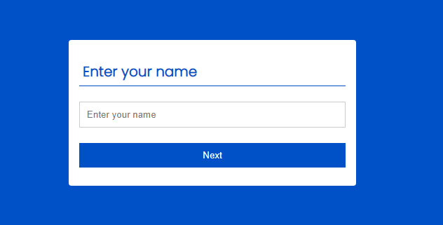
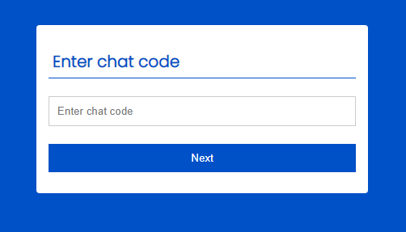

# Real-time-Chat-Application
A Realtime chat application build in HTML, CSS, Js, PHP and MySQL. 
It's just a simple chat application in which you can chat with a perticular person or with a group of people.
It;s simple and easy.

Best part of this application is all your chats will be deleted from the database as soon as admin close the chat.


Home screen: 


First chat room should be created , head to ```start chat``` and you will see:


You have to enter your name, and you will be the ```Admin``` of this room. Just enter your name and hit ```Enter```


Now you have to enter a chat name , it will be the room name.
hit enter and you will get the ```uniqe code``` to share to everyone to join this chat.


Now you have to share the ```code``` to everyone you wanna chat with, and ask them to join via ```join chat``` option on thw home page.

on clicking ```join chat``` one can see:



click ```next```



now you have to enter the chat code share by your friend,
and hit ```enter```

The chat UI will look like:


on clicking the hamperbarg menu you can see the chat name and the unique code.

untill chat is completed Admin should not close the tab otherwise he can't join the chat again the the chat will be saved in the database forever. Admin must close the chat by clicking Close button available on the hamperbarg menu.

Except Admin everyone can leave the chat by clicking ```Leave``` available on the hamperbarg menu, and can join with the same username again as soon as room is available, if any use leave the chat by closing tab he or she can't join with the same username again.
