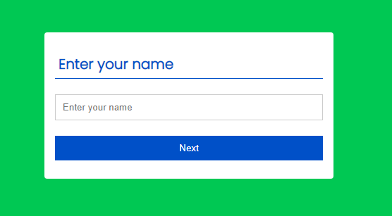
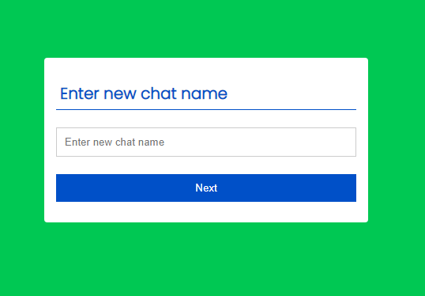
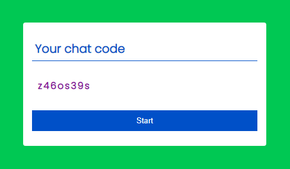

# Real-time-Chat-Application
A Realtime chat application build in HTML, CSS, Js, PHP and MySQL. 
It's just a simple chat application in which you can chat with a perticular person or with a group of people.
It;s simple and easy.

Best part of this application is all your chats will be deleted from the database as soon as admin close the chat.

Home screen: 

First chat room should be created , head to start chat and you will see:

You have to enter your name, and you will the Admin of this room. Just enter your name and hit Enter.

Now you have to enter a chat name , it will be the room name.
hit enter and you will get the uniqe code to share to everyone to join this chat.

